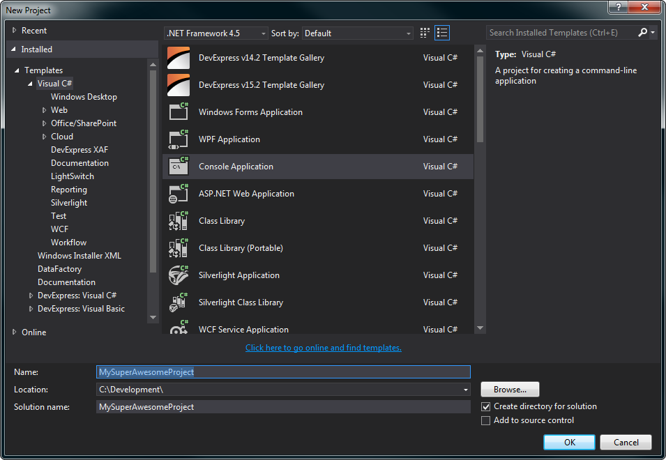
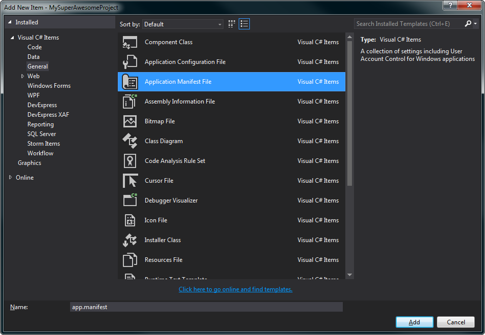
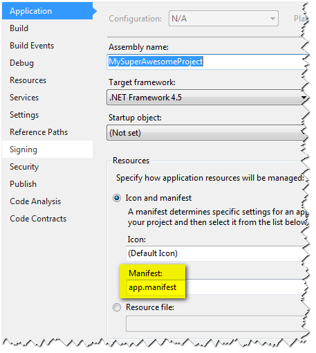

I haven't found any good intro to this online (only parts of it), so I will give my best to describe the process I took here.

The goal is, to create a [ClickOnce][clickonce] installer for a .NET project,
which contains a dependency to a COM object. The quirk here is, that we have to deploy this COM object with
the project and we have no control over it. We just have been given a DLL, which in turn is a native COM object.

<span class="more"></span>

## Prerequisites

We have gotten a native COM dll named `ForeignInterface.dll`, which we have to deploy with our project.

The problem is, that [ClickOnce][clickonce] does't allow to register COM objects on installation, as the ClickOnce installation runs in the security context of the user.

We have two possibilities here. We can create a separate [MSI][msi] installer and add it as prerequisite to the ClickOnce installer
or we can use [Registration-Free COM Interop][regfree].

I describe here the latter, as it has some quirks to it, which I will address here.

***Warning: All id's, names etc. I use here are faked. So please replace them with your own.***

## Step 1: Creating the project

For demonstration purposes, we create a simple console project:



The project lives now in `C:\Development\MySuperAwesomeProject\MySuperAwesomeProject`.

Next we import the native COM dll, so that the DLL is copied over to the `bin` directory:

* Right click on your project
* Click on `Add` &rarr; `Existing Item`
* Select `All Files (*.*)` in the filter combo box
* Browse to the `ForeignInterface.dll` and select it
* Click `Add`
* The select it in the Solution Explorer and set `Copy to Output Directory` to `Copy if newer`
* Your Solution should now look like this:

  
* Also the `ForeignInterface.dll` should have been copied over to your project directory.

## Step 2: Creating a COM wrapper

First we have to create a Wrapper, so that we can use the native COM object in .NET.

The most control we have with the [`tlbimp.exe`][tlbimp] tool.
So we open the `Developer Command Prompt for VS2013`, go to our project directory and use this command to create an Interop assembly:

```bat
tlbimp.exe /out:Interop.ForeignInterface.dll /namespace:ForeignInterface ForeignInterface.dll
```

This creates the the Interop Assembly `Interop.ForeignInterface.dll` in our project folder.
For further information see [here][tlbimphowto].

Now we add it as Reference to our project:

* Right click on `References` and then on `Add Reference...`
* Click `Browse`, browse to your `Interop.ForeignInterface.dll` and add it.
* Then click `OK` in the Reference manager.

We now can test our COM interface:

```csharp
namespace MySuperAwesomeProject
{
    using System;
    using System.Diagnostics;
    using System.Runtime.InteropServices;
    using ForeignInterface;

    public class Program
    {
        public static void Main(string[] args)
        {
            try
            {
                var impl = new ForeignInterface();
                Console.WriteLine(impl.Process("FOO"));
            }
            catch (COMException e)
            {
                Console.WriteLine("ERROR: {0}", e.Message);
            }
            Console.ReadKey();
        }
    }
}
```

If we execute this, then the following error should occur:

```cmd
ERROR: Retrieving the COM class factory for component with CLSID {A1A168E6-3591-41C9-87D6-3E21588C7FFB} failed due to the following error: 80040154 Class not registered (Exception from HRESULT: 0x80040154 (REGDB_E_CLASSNOTREG)).
```

If we get a valid result, then the COM component is already registered.
For further testing we open an Administrator console, navigate to the project directory and execute the following command:

```cmd
regsvr32 /u ForeignInterface.dll
```

This deregisters the COM component in the system, and the error message above should occur on execution.

## Step 3: Preparing for Registration-Free COM Interop

This is a two step process. First we need a side-by-side manifest for the `ForeignInterface.dll`, so we can reference it as dependency in our application.
Then we have to create an application manifest which adds the side-by-side manifest as dependency.

### Step 3.1: Creating a side-by-side manifest for the COM dll

for this we use the [`mt.exe`][mtexe] from the Windows SDK:

```cmd
mt.exe -dll:ForeignInterface.dll -tlb:ForeignInterface.dll -out:ForeignInterface.sxs.manifest
```

This creates a basic manifest file for the `ForeignInterface.dll`:

```xml
<?xml version="1.0" encoding="UTF-8" standalone="yes"?>
<assembly xmlns="urn:schemas-microsoft-com:asm.v1" manifestVersion="1.0">

  <file name="ForeignInterface.dll" hashalg="SHA1">
    <comClass clsid="{A1A168E6-3591-41C9-87D6-3E21588C7FFB}"
              tlbid="{7B2E8C1F-CCB0-4261-8289-6598529DBDAF}"/>
    <typelib tlbid="{7B2E8C1F-CCB0-4261-8289-6598529DBDAF}"
             resourceid="1"
             version="2.1"
             helpdir=""
             flags="HASDISKIMAGE" />
  </file>

  <comInterfaceExternalProxyStub name="IForeignInterface"
                                 iid="{63A461A0-93A1-407D-B144-C69F7F299315}"
                                 tlbid="{7B2E8C1F-CCB0-4261-8289-6598529DBDAF}"
                                 proxyStubClsid32="{00020424-0000-0000-C000-000000000046}"/>
</assembly>
```

We now add this manifest to the project as above, so that it will also be copied over into the `bin` directory on build.

Your solution now looks like this:


The manifest is now changed a bit, as we need an assembly identity we can refer to:

```xml
<?xml version="1.0" encoding="UTF-8" standalone="yes"?>
<assembly xmlns="urn:schemas-microsoft-com:asm.v1" manifestVersion="1.0">
  <assemblyIdentity type="win32" name="ForeignInterface.sxs" version="2.1.0.0" />

  <file name="ForeignInterface.dll" hashalg="SHA1">
    <comClass clsid="{A1A168E6-3591-41C9-87D6-3E21588C7FFB}"
              tlbid="{7B2E8C1F-CCB0-4261-8289-6598529DBDAF}"/>
    <typelib tlbid="{7B2E8C1F-CCB0-4261-8289-6598529DBDAF}" version="2.1" helpdir=""  />
  </file>

  <comInterfaceExternalProxyStub name="IForeignInterface"
                                 iid="{63A461A0-93A1-407D-B144-C69F7F299315}"
                                 tlbid="{7B2E8C1F-CCB0-4261-8289-6598529DBDAF}"
                                 proxyStubClsid32="{00020424-0000-0000-C000-000000000046}"/>
</assembly>
```

*Note that I added the `assemblyIdentity` tag with the same name as the manifest but without the `.manifest` extension. I also removed the `flags` and the `resourceid` attributes from the `typelib` tag as they are not needed.*

If you wish, you can also add a `description` attribute to the `typelib` and `comClass` tags.

### Step 3.2: Creating an application manifest and adding the dependency

Now we have to add the dependency to our application. For this we create an application manifest:

* Right click on your Project
* `Add` &rarr; `New Item...`
* `General` &rarr; `Application Manifest File`:

  

Now we replace the content of the application manifest with the following:

```xml
<?xml version="1.0" encoding="utf-8"?>
<asmv1:assembly manifestVersion="1.0" xmlns="urn:schemas-microsoft-com:asm.v1" xmlns:asmv1="urn:schemas-microsoft-com:asm.v1" xmlns:asmv2="urn:schemas-microsoft-com:asm.v2" xmlns:xsi="http://www.w3.org/2001/XMLSchema-instance">
  <trustInfo xmlns="urn:schemas-microsoft-com:asm.v2">
    <security>
      <requestedPrivileges xmlns="urn:schemas-microsoft-com:asm.v3">
        <requestedExecutionLevel level="asInvoker" uiAccess="false" />
      </requestedPrivileges>
    </security>
  </trustInfo>

  <dependency>
    <dependentAssembly>
      <assemblyIdentity type="win32" name="ForeignInterface.sxs" version="2.1.0.0" />
    </dependentAssembly>
  </dependency>
</asmv1:assembly>
```

*The crucial part here is the `dependentAssembly` tag. The contained `assemblyIdentity` should be the same as the one in `ForeignInterface.sxs.manifest`. If you have more then one COM object to include, simply add more `dependency` tags.*

The last step is to set the `app.manifest` as application manifest and disable the Visual Studio Hosting process:




*You need to disable the VS hosting process, as the `MyAwesomeProject.vshost.exe` uses a different manifest, and therefore debugging would not work. Also if you want to unit test your COM-Object, you have to do extra steps which I will not explain here. For further information see [here][funcfun].*

Congratulations, your project should now run correctly without error.

## Step 4: Preparing the Paket and F#AKE

I will use [Paket] and [F#AKE] here for simplicity purposes.

### Step 4.1: Preparing Paket

1. Create a new directory in your solution directory named `.paket`
   * **Tip:** enter `.paket.` (the name ending with a full-stop) as directory name when creating the directory with Windows explorer
2. Download the `paket.bootstrapper.exe` from <https://github.com/fsprojects/Paket/releases> and put it into the `.paket` directory
   * This executable will also be checked in into your Source Code Management System!
3. Add the following batch file (for convenience) and name it `paket.bat`
   ```bat
   @ECHO OFF

   .paket\paket.bootstrapper.exe
   IF ERRORLEVEL 1 (
     EXIT /B %ERRORLEVEL%
   )

   .paket\paket.exe %*
   ```
4. now run `paket init` on the command line in your solution dir
   * This downloads the current version of [Paket] and creates an initial `paket.dependencies` file
5. modify the `paket.dependencies` so that it looks like this:
   ```paket
   source https://www.nuget.org/api/v2

   nuget FAKE
   ```
6. now run `paket install` on the command line
   * This downloads the [F#AKE] NuGet package into the packages folder under `packages\FAKE` and creates the `paket.lock` file
   * both `paket.lock` and `paket.dependencies` should be checked in into your SCM
   * the `packages` folder and the `.paket\paket.exe` should stay out of your SCM!
7. For convenience reasons we create also a `fake.bat` file:
   ```bat
   @ECHO OFF
   CLS

   CALL paket.bat restore
   IF ERRORLEVEL 1 (
     EXIT /B %ERRORLEVEL%
   )

   SET FAKE="%~dp0packages\FAKE\tools\FAKE.EXE"

   :build
   ECHO ----------- BUILDING ---------------------
   IF EXIST "%~dp0Build.log" DEL /F /Q "%~dp0Build.log"
   %FAKE% "%~dp0build.fsx" %1 -lf Build.log
   PAUSE
   ```

### Step 4.2: Adding a F#AKE build script

***You should install "Visual F#" and the "Visual F# Power Tools" extensions in Visual Studio, 
if you want to edit the build file with IntelliSense. Another option would be Visual Studio Code with the [Ionide] Extension***

First add a new F# script file (or TextFile, if this template is missing) to your solution (in your solution directory) and name it `build.fsx`

My `build.fsx` has the following content:

```fsharp
#r "packages/FAKE/tools/FakeLib.dll"

open Fake

// project and version info
let projectName = "MySuperAwesomeProject"
let version = "0.1.0.0"  // or retrieve from CI server

// Directories
let buildDir  = @".\build\"
let deployDir = @".\deploy\"
let publishDir = deployDir  @@ (sprintf "%s.%s" projectName version)

// Filesets
let appReferences  = !! "**/*.csproj"

Target "Clean" (fun _ ->
    CleanDirs [buildDir; deployDir; publishDir]
)

Target "Build" (fun _ ->
    MSBuildRelease buildDir "Build" appReferences
    |> Log "Release Build-Output: "
)

Target "Prepare Deployment" (fun _ ->
    trace "This will be filled in a moment"
)

Target "Create ClickOnce Installer" (fun _ ->
    trace "This will be filled in a moment"
)

Target "Deploy" (fun _ ->
    trace "Deploy the created ClickOnce installer wherever you want"
)

"Clean"
  ==> "Build"
  ==> "Prepare Deployment"
  ==> "Create ClickOnce Installer"
  ==> "Deploy"

RunTargetOrDefault "Deploy"
```

You should now be able to build the project on the command line via `fake`.
The build output should land in the `build` directory and an empty `deploy` directory should be created.
For more information about how to use [F#AKE] see [here][fakegs].

## Step 5: Creating the ClickOnce Application

Now for the gist of this article. To create a ClickOnce application we use the [Manifest Generation and Editing Tool][mage] (`mage.exe`).
In [F#AKE] exists a [helper](http://fsharp.github.io/FAKE/apidocs/fake-magehelper.html) which will do most of the work for us.

First we implement the `"Prepare Deployment"` target:

```fsharp
Target "Prepare Deployment" (fun _ ->
    !! (buildDir @@ "**/*.*")
    -- "**/ForeignInterface.dll"
    -- "**/*.pdb"
    |> CopyFiles publishDir
)
```

This copies everything except the `ForeignInterface.dll` and all `.pdb` files into the deployment directory.

***The `ForeignInterface.dll` is skipped here because it would otherwise referenced by the `mage` tool, which leads to an attempt to copy the DLL twice because the side-by-side manifest references this DLL also. This in turn would lead to an error on installation!***

On the beginning of the file we add a helper, so we can use it as a reference:

```fsharp
let EmptyMageParams =  {
  ToolsPath = "C:/Program Files (x86)/Microsoft SDKs/Windows/v8.1A/bin/NETFX 4.5.1 Tools"
  Manifest = ""
  ApplicationFile = ""
  CertFile = None

  Name = projectName
  Version = version
  Processor = X86
  TrustLevel = None
  Publisher = Some "MyAwesomeCompany"
  ProviderURL = ""
  SupportURL = None
  FromDirectory = ""

  ProjectFiles = []
  IconPath = ""
  IconFile = ""
  TmpCertFile = ""
  Password = None
  CertHash = None
  IncludeProvider = None
  Install = None
  UseManifest = None
  CodeBase = None
}
```

Now we can create our `"Create ClickOnce Installer"` target:

```fsharp
Target "Create ClickOnce Installer" (fun _ ->
    let appManifest = publishDir @@ (sprintf "%s.exe.manifest" projectName)
    let deployManifest = sprintf "%s.application" projectName
    let appParams = { EmptyMageParams with Manifest = appManifest
                                           ApplicationFile = publishDir @@ (sprintf "%s.exe" projectName)
                                           TrustLevel = Some FullTrust
                                           FromDirectory = publishDir
                                           IconPath = publishDir
                                           IconFile = projectName + ".ico"
                                           IncludeProvider = Some false
                                           UseManifest = Some true }

    let deployParams = { EmptyMageParams with Manifest = appManifest
                                              ApplicationFile = deployDir @@ deployManifest
                                              Install = Some true }
    MageCreateApp appParams
    // MageSignManifest appParams
    MageDeployApp deployParams
    // MageSignDeploy deployParams

    (buildDir @@ "ForeignInterface.dll") |> CopyFile publishDir
)
```

*Note that we copy the `ForeignInterface.dll` to the deployment directory **after** we created and signed the manifests.**

If you want to sign the manifests you need to add a certificate file to the solution. You can then
reference this file with the `CertFile` setting in the `EmptyMageParams`. You can then uncomment the `MageSignManifest` and `MageSignDeploy` commands.

I usually want to change also the `.application` file a bit, so that the application will be updated on start.
For this I have written a little helper function, which is added at the beginning of the `build.fsx`:

```fsharp
#r "System.Xml.Linq.dll"
open System.Xml.Linq

let setUpdatePolicy (filename: string) =
    let n nameSpace name = XName.op_Implicit (nameSpace + name)

    let asmv1 = "{urn:schemas-microsoft-com:asm.v1}"
    let asmv2 = "{urn:schemas-microsoft-com:asm.v2}"
    let cov1 = "{urn:schemas-microsoft-com:clickonce.v1}"

    let removeNode name (node: XElement option) =
        match node with
        | None -> None
        | Some n ->
            match n.Element(name) with
            | null -> ()
            | e -> e.Remove()
            node

    let addNode (name: XName) (node: XElement option) =
        match node with
        | Some n -> n.Add(new XElement(name))
        | _ -> ()

    let element name (node: XElement option) : XElement option =
        match node with
        | None -> None
        | Some n ->
            match n.Element(name) with
            | null -> None
            | e -> Some e

    let doc = XDocument.Load(filename)

    Some doc.Root
    |> element (n asmv2 "deployment")
    |> element (n asmv2 "subscription")
    |> element (n asmv2 "update")
    |> removeNode (n asmv2 "expiration")
    |> addNode (n asmv2 "beforeApplicationStartup")

    doc.Save(filename)
```

Now i can call

```fsharp
deployDir @@ deployManifest |> setUpdatePolicy
```

directly before `MageSignDeploy`.

## TL:DR

The important parts are:

* Deploy the COM DLL and a corresponding `.sxs.manifest`
* Add a dependency to the `.sxs.manifest` in the application manifest
* The publish directory should have a version on it, so you can simply deploy a new version into your target directory and just update the `.application` file.
* Copy all files except for the COM DLL into the Publish Directory
* Copy the COM DLL **after** creation of the ClickOnce manifests

The final script now looks like this.

```fsharp
#r "packages/FAKE/tools/FakeLib.dll"

open Fake

// project and version info
let projectName = "MySuperAwesomeProject"
let version = "0.1.0.0"  // or retrieve from CI server

// Directories
let buildDir  = @".\build\"
let deployDir = @".\deploy\"
let applicationDirName = (sprintf "%s.%s" projectName version)
let publishDir = deployDir @@ applicationDirName

// Filesets
let appReferences  = !! "**/*.csproj"


let EmptyMageParams =  {
    ToolsPath = @"C:\Program Files (x86)\Microsoft SDKs\Windows\v8.1A\bin\NETFX 4.5.1 Tools"
    Manifest = ""
    ApplicationFile = ""
    CertFile = None

    Name = projectName
    Version = version
    Processor = MSIL
    TrustLevel = None
    Publisher = Some "MyAwesomeCompany"
    ProviderURL = ""
    SupportURL = None
    FromDirectory = ""

    ProjectFiles = []
    IconPath = ""
    IconFile = ""
    TmpCertFile = ""
    Password = None
    CertHash = None
    IncludeProvider = None
    Install = None
    UseManifest = None
    CodeBase = None }


#r "System.Xml.Linq.dll"
open System.Xml.Linq

let setUpdatePolicy (filename: string) =
    let n nameSpace name = XName.op_Implicit (nameSpace + name)

    let asmv1 = "{urn:schemas-microsoft-com:asm.v1}"
    let asmv2 = "{urn:schemas-microsoft-com:asm.v2}"
    let cov1 = "{urn:schemas-microsoft-com:clickonce.v1}"

    let removeNode name (node: XElement option) =
        match node with
        | None -> None
        | Some n ->
            match n.Element(name) with
            | null -> ()
            | e -> e.Remove()
            node

    let addNode (name: XName) (node: XElement option) =
        match node with
        | Some n -> n.Add(new XElement(name))
        | _ -> ()

    let element name (node: XElement option) : XElement option =
        match node with
        | None -> None
        | Some n ->
            match n.Element(name) with
            | null -> None
            | e -> Some e

    let doc = XDocument.Load(filename)

    Some doc.Root
    |> element (n asmv2 "deployment")
    |> element (n asmv2 "subscription")
    |> element (n asmv2 "update")
    |> removeNode (n asmv2 "expiration")
    |> addNode (n asmv2 "beforeApplicationStartup")

    doc.Save(filename)


Target "Clean" (fun _ ->
    CleanDirs [buildDir; deployDir; publishDir]
)

Target "Build" (fun _ ->
    MSBuildRelease buildDir "Build" appReferences
    |> Log "Release Build-Output: "
)

Target "Prepare Deployment" (fun _ ->
    !! (buildDir @@ "**/*.*")
    -- "**/ForeignInterface.dll"
    -- "**/*.pdb"
    |> CopyFiles publishDir
)

Target "Create ClickOnce Installer" (fun _ ->
    let appManifest = publishDir @@ (sprintf "%s.exe.manifest" projectName)
    let deployManifest = sprintf "%s.application" projectName
    let appParams = { EmptyMageParams with Manifest = appManifest
                                           ApplicationFile = publishDir @@ (sprintf "%s.exe" projectName)
                                           TrustLevel = Some FullTrust
                                           FromDirectory = publishDir
                                           IconPath = publishDir
                                           IconFile = projectName + ".ico"
                                           IncludeProvider = Some false
                                           UseManifest = Some true }

    let deployParams = { EmptyMageParams with Manifest = appManifest
                                              ApplicationFile = deployDir @@ deployManifest
                                              Install = Some true }
    MageCreateApp appParams
    // MageSignManifest appParams
    MageDeployApp deployParams
    deployDir @@ deployManifest |> setUpdatePolicy
    // MageSignDeploy deployParams

    (buildDir @@ "ForeignInterface.dll") |> CopyFile publishDir
)

Target "Deploy" (fun _ ->
    trace "Deploy the created ClickOnce installer wherever you want"
)

"Clean"
  ==> "Build"
  ==> "Prepare Deployment"
  ==> "Create ClickOnce Installer"
  ==> "Deploy"

RunTargetOrDefault "Deploy"
```

You should be able to run `fake` and in the `deploy` directory
will be a ClickOnce installer created, which you can deploy anywhere you want.
I hope this helps a bit. Good luck with your own projects.


[clickonce]: https://en.wikipedia.org/wiki/ClickOnce  "ClickOnce description on WikiPedia"
[msi]: https://en.wikipedia.org/wiki/Windows_Installer "Windows installer description on WikiPedia"
[regfree]: https://msdn.microsoft.com/en-us/library/fh1h056h(v=vs.110).aspx "Registration-Free COM Interop"
[tlbimp]: https://msdn.microsoft.com/en-us/library/tt0cf3sx(v=vs.110).aspx "Description of the tlbimp.exe"
[tlbimphowto]: https://msdn.microsoft.com/en-us/library/tw4zwhbe(v=vs.110).aspx "Further information for creating Interop assemblies"
[mtexe]: https://msdn.microsoft.com/en-us/library/aa375649(v=vs.85).aspx "Description of the mt.exe"
[funcfun]: http://blog.functionalfun.net/2012_09_01_archive.html "A quick guide to Registration-Free COM in .Net–and how to Unit Test it"
[Paket]: http://fsprojects.github.io/Paket/ "Paket"
[F#AKE]: http://fsharp.github.io/FAKE/ "F#AKE"
[fakegs]: http://fsharp.github.io/FAKE/gettingstarted.html "Getting Started with F#AKE"
[Ionide]: http://ionide.io "Crossplatform F# Editor"
[mage]: https://msdn.microsoft.com/en-us/library/acz3y3te(v=vs.110).aspx "Mage.exe (Manifest Generation and Editing Tool)"