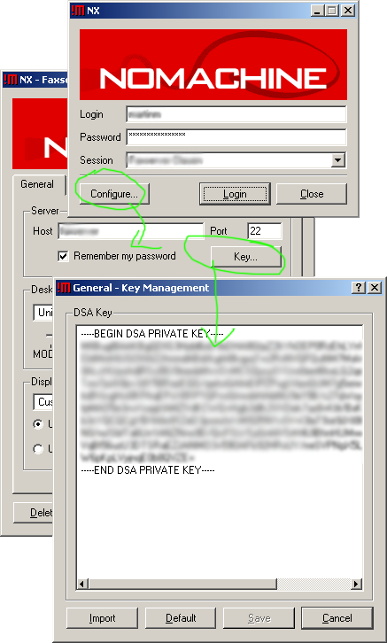

title: FreeNx Howto auf CentOS 4
author: magicmonty
date: 2006-04-04 07:57
template: article.jade
category: CentOS, FreeNX, Linux

Hier beschreibe ich mal, wie ich den FreeNX-Server unter CentOS zum Laufen bekommen habe

1. Konsole öffnen
2. als root:

/etc/ssh/sshd_config anpassen:

    Port 22
    Protocol 2
    HostKey /etc/ssh/ssh_host_rsa_key
    HostKey /etc/ssh/ssh_host_dsa_key
    SyslogFacility AUTHPRIV
    PermitRootLogin yes
    PubkeyAuthentication yes
    AuthorizedKeysFile      %h/.ssh/authorized_keys2
    RhostsRSAAuthentication no
    PasswordAuthentication no
    ChallengeResponseAuthentication no
    GSSAPIAuthentication yes
    GSSAPICleanupCredentials yes
    UsePAM yes
    AllowTcpForwarding yes
    X11Forwarding yes
    Subsystem       sftp    /usr/libexec/openssh/sftp-server

`/etc/init.d/sshd restart`

danach unbedingt für alle Benutzer, die sich per SSH einloggen können sollen, folgendes machen:

1. `ssh-keygen -t dsa` (zu Sicherheit Passwort vergeben)
2. `cat ~/.ssh/id_dsa.pub >> ~/.ssh/authorized_keys2` (oder `ln -s ~/.ssh/id_dsa.pub ~/.ssh/authorized_keys2`)
3. die enstandene Datei `~/.ssh/id_dsa` auf die Clients kopieren, damit sie sich per SSH einloggen können

<pre>
yum update
yum install freenx nx
</pre>
    
die Datei `/etc/nxserver/client.id_dsa.key` auf den Clientrechner kopieren

1. man kann sie zum Testen benutzen um per Benutzer nx auf den NX-Server zuzugreifen
2. beim Windows-Client wird der Key per Configure->Key…->Import hinzugefügt:

    nxserver –adduser username
    nxserver –passwd username
    
Danach sollte FreeNX eigentlich laufen